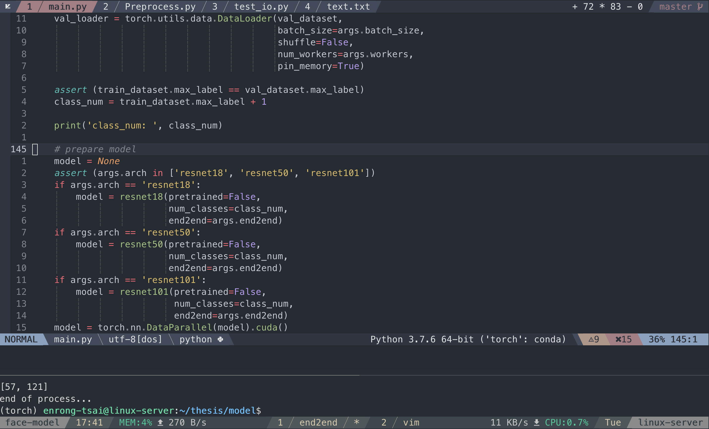

# Intro
This repository keeps my vim settings, tmux configuration and other dotfiles.
The configuration implements an IDE like python development environment on a terminal, which benefits cross-platform development on localhost and remote machines using SSH.

<p align="center">
  
</p>

## Usage
To automatically distribute dotfiles, clone this repo by following steps:
```
$ git clone --bare <https://github.com/enrongtsai/dotfiles.git> $HOME/.cfg
$ echo ".cfg" >> .gitignore
$ alias config='/usr/bin/git --git-dir=$HOME/.cfg/ --work-tree=$HOME'
$ config checkout
$ config config --local status.showUntrackedFiles no
```

**Note 1:**
If your $HOME folder already have some stock configuration files which would be overwritten by Git, back up the offending files to a backup folder by following scripts:
```
$ mkdir -p .config-backup && \
config checkout 2>&1 | egrep "\s+\." | awk {'print $1'} | \
xargs -I{} mv {} .config-backup/{}
```

**Note 2:**
You can add the alias definition to your `.bashrc` by following scripts:
```
echo "alias config='/usr/bin/git --git-dir=$HOME/.cfg/ --work-tree=$HOME'" >> $HOME/.bashrc
```

## Requirements

- [junegunn/vim-plug](https://github.com/junegunn/vim-plug)
- [junegunn/fzf](https://github.com/junegunn/fzf/)
- [TPM](https://github.com/tmux-plugins/tpm/)

### Install plugins via [vim-plug](https://github.com/junegunn/vim-plug)

Reload .vimrc and `:PlugInstall` to install plugins.
**Note:**
You can add new plugin to `~/.vimrc` with `Plug '.../...'` between `call plug#begin()` and `call plug#end()`.

### Install plugins via [TPM](https://github.com/tmux-plugins/tpm/)

Installs and loads `tmux` plugins:
- Reload TMUX environment press `prefix` + `r`
- Install plugins press `prefix` + `I`
- Update plugins press `prefix` + `U`
- Uninstall plugins not on the plugin list press `prefix` + `alt` + `u`

**Note:**
You can add new plugin to `~/.tmux.conf` with `set -g @plugin '...'`

## Useful plugins
### vim
* [neoclide/coc.nvim](https://github.com/neoclide/coc.nvim)
* [dense-analysis/ale](https://github.com/dense-analysis/ale)
* [cjrh/vim-conda](https://github.com/cjrh/vim-conda)
* [junegunn/fzf](https://github.com/junegunn/fzf)
* [junegunn/fzf.vim](https://github.com/junegunn/fzf.vim)
* [sainnhe/sonokai](https://github.com/sainnhe/sonokai)
* [ryanoasis/vim-devicons](https://github.com/ryanoasis/vim-devicons)
* [yggdroot/indentline](https://github.com/yggdroot/indentline)
* [sainnhe/tmuxline.vim](https://github.com/sainnhe/tmuxline.vim)
* [christoomey/vim-tmux-navigator](https://github.com/christoomey/vim-tmux-navigator)
* [scrooloose/nerdtree](https://github.com/scrooloose/nerdtree)
* [jistr/vim-nerdtree-tabs](https://github.com/jistr/vim-nerdtree-tabs)
* [itchyny/lightline.vim](https://github.com/itchyny/lightline.vim)
* [itchyny/vim-gitbranch](https://github.com/itchyny/vim-gitbranch)
* [macthecadillac/lightline-gitdiff](https://github.com/macthecadillac/lightline-gitdiff)
* [maximbaz/lightline-ale](https://github.com/maximbaz/lightline-ale)
* [benmills/vimux](https://github.com/benmills/vimux)
* [easymotion/vim-easymotion](https://github.com/easymotion/vim-easymotion)
* [tpope/vim-commentary](https://github.com/tpope/vim-commentary)
* [tpope/vim-surround](https://github.com/tpope/vim-surround)
* [romainl/vim-cool](https://github.com/romainl/vim-cool)
* [thaerkh/vim-workspace](https://github.com/thaerkh/vim-workspace)
* [jiangmiao/auto-pairs](https://github.com/jiangmiao/auto-pairs)
* [vim-python/python-syntax](https://github.com/vim-python/python-syntax)
* [jeetsukumaran/vim-pythonsense](https://github.com/jeetsukumaran/vim-pythonsense)
* [heavenshell/vim-pydocstring](https://github.com/heavenshell/vim-pydocstring)
* [tmhedberg/SimpylFold](https://github.com/tmhedberg/SimpylFold)
* [liuchengxu/vista.vim](https://github.com/liuchengxu/vista.vim)
### tmux
* [tmux-plugins/tpm](https://github.com/tmux-plugins/tpm)
* [tmux-plugins/tmux-sensible](https://github.com/tmux-plugins/tmux-sensible)
* [tmux-plugins/tmux-prefix-highlight](https://github.com/tmux-plugins/tmux-prefix-highlight)
* [tmux-plugins/tmux-net-speed](https://github.com/tmux-plugins/tmux-net-speed)
* [samoshkin/tmux-plugin-sysstat](https://github.com/samoshkin/tmux-plugin-sysstat)
* [tmux-plugins/tmux-resurrect](https://github.com/tmux-plugins/tmux-resurrect)
* [tmux-plugins/tmux-continuum](https://github.com/tmux-plugins/tmux-continuum)
* [christoomey/vim-tmux-navigator](https://github.com/christoomey/vim-tmux-navigator)
